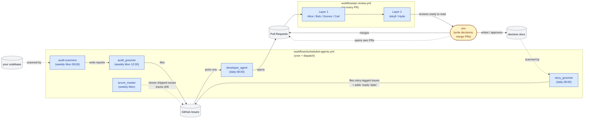
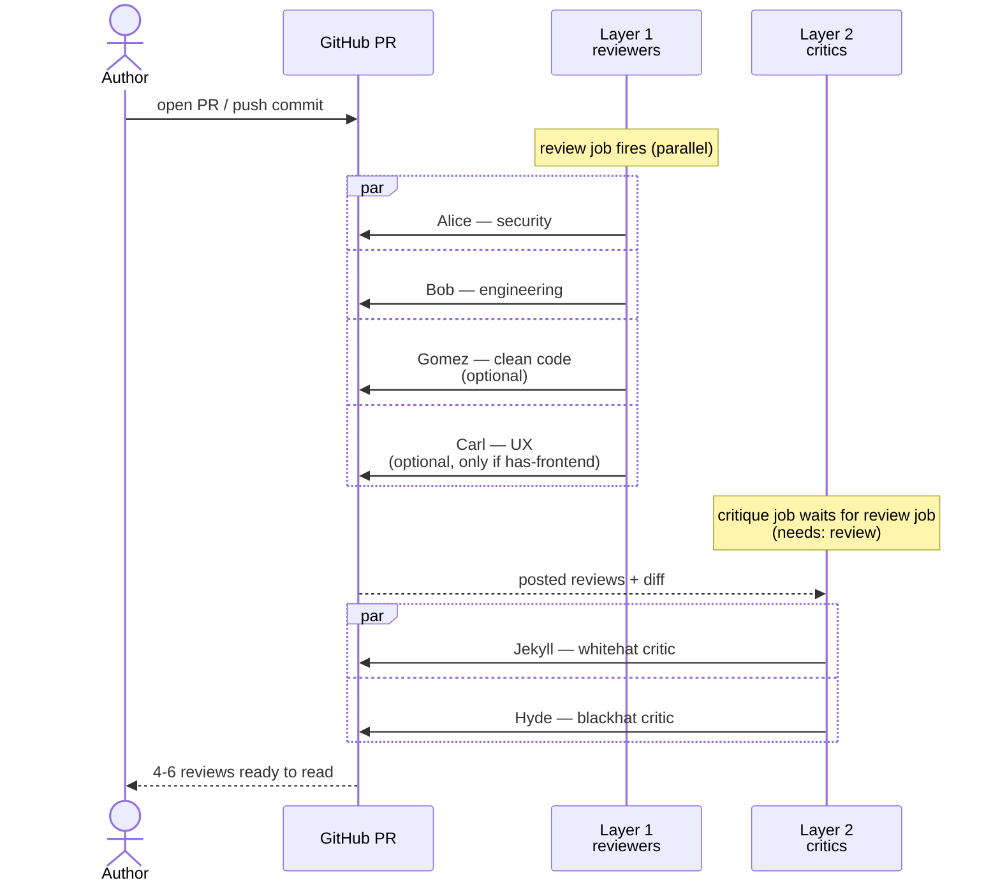
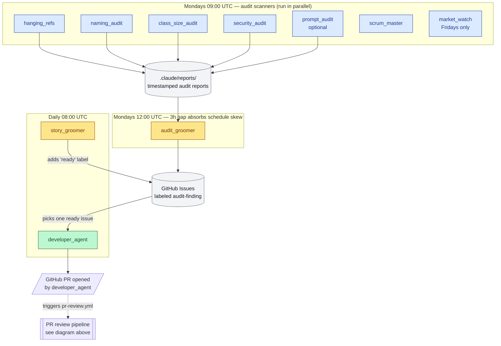

# developer.ai

**The end-to-end Claude Code loop for solo developers and small teams.** Scheduled audit bots scan your repo and file ready-state GitHub issues; a developer-agent picks them up and opens PRs that close them; a named six-person review fleet (security, engineering, UX, clean-code, plus a blackhat/whitehat critic pair) leaves advisory comments on every PR. None of the reviewers block merge — the author always decides. Claude-only by design; install with `/install` in Claude Code.

This isn't another agent collection — it's the full workflow loop one developer needs to operate a repo. The kit ships opinionated defaults you tune via an install-time wizard, plus convention docs (`CLAUDE.md`, `ENGINEERING_PRINCIPLES.md`, PR/backlog workflows) tag-classified Generic / Architecture-Conditional / Personal-Preference / Domain-Specific so you know what to keep and what to strip.

You clone this repo, open Claude Code in it, and run `/install`. The installer asks you about your stack, your conventions, and your repo identity; it then writes the calibrated kit into your target repo on a new branch. Once you add the `CLAUDE_CODE_OAUTH_TOKEN` GitHub secret, the agents start firing on your next PR.

> **The fast install path:** [`INSTALL.md`](INSTALL.md).
> **The manual install path:** [`ADAPTING.md`](ADAPTING.md).
> **Tuning after install:** [`CALIBRATE.md`](CALIBRATE.md) (lives in your target repo after install).

---

## What this repo is, and what it isn't

**This repo is a kit.** It contains agent specs (markdown files Claude Code reads at runtime), reference GitHub Actions workflows, project-context templates, worked examples, and a small library of skills. It is not a service you sign up for: there's no SaaS dashboard, no API to call. Everything runs inside your own GitHub repo against your own Actions minutes (or self-hosted runners), and you pay Anthropic for the model calls the agents make.

**This repo is not the agents themselves.** The agents run inside Claude Code via the [`anthropics/claude-code-action`](https://github.com/anthropics/claude-code-action) GitHub Action. This repo is what tells those agents who they are, what to look for, and what your project's conventions are. Think of it as a job description plus a company handbook.

**The kit ships opinionated defaults.** Most projects don't want to fill in 47 blank slots before the agents do anything useful. The templates, the engineering principles, and the agent rules ship with sensible defaults already in place, based on patterns from a real production codebase. The installer adjusts those defaults based on your wizard answers; you edit further if your project's reality differs. The kit is MIT-licensed; fork and modify freely.

---

## Who should use it

- **Solo developers and small teams** who want code review without a second human. Alice and Bob catch most of what an experienced reviewer would catch, and Jekyll and Hyde catch the parts where Alice and Bob were wrong.
- **Teams adopting AI-assisted development** who want guardrails on what the AI writes. The same review pipeline that reviews human PRs reviews AI-written PRs.
- **Open-source maintainers** who want consistent automated review on contributor PRs.
- **Anyone tired of manually filing tracking issues for shipped work.** The scrum-master agent does that bookkeeping autonomously.

You should probably NOT use it if:

- Your project is a one-off prototype you'll throw away in a month (setup cost won't pay back).
- You don't have a GitHub repo (the agents file issues and post PR reviews via the GitHub API; that's the integration surface).
- You can't afford Anthropic API tokens (a typical small project burns a few dollars a week; large repos with many PRs scale up from there).

---

## How a typical adopter uses it

1. **Install.** Clone this repo, open Claude Code in it, run `/install`. Answer the wizard. The installer commits the kit on a new branch in your target repo.
2. **Add the GitHub secret.** Set `CLAUDE_CODE_OAUTH_TOKEN` in your target repo's GitHub Secrets.
3. **Calibrate.** Read the templates the installer just created. Tighten anything where your reality differs from the defaults the installer picked. See `docs/CALIBRATE.md` in your target repo for the walkthrough.
4. **Test PR.** Open a throwaway PR (even a one-line README edit). The agents should fire. Tune the templates if findings are noisy.
5. **Normal use.** Open PRs as you normally would. The agents fire automatically. On the rare PR where you don't want them (a giant infra refactor, an emergency hotfix), add the `skip-ci` label.
6. **Weekly bots.** Mondays by default: the audit bots scan the codebase for drift, dead code, naming violations, security drift, and ecosystem changes. They write reports to `.claude/reports/`. The `audit-groomer` bot reads those reports the next day and files pickup-ready issues. The `developer-agent` bot picks one issue per day and opens a PR for it.
7. **Periodic re-read.** Re-read your templates whenever you notice their assumptions drifting from reality (your scale target grew, you added a new service, you changed your hosting model). The agents pick up the new calibration on the next run.

---

## Two ways the agents get invoked

Every agent in this kit runs in one of two modes; both are first-class and they're complementary, not redundant.

**On-demand (conversational).** You ask in Claude Code and the agent runs. The frontmatter `description` on every agent file ends with a list of natural-language phrases that activate it, so "scan for dead code" triggers `hanging_refs`, "groom the backlog" triggers `scrum_master`, and "set this up on my project" triggers the installer. Use this when something's bugging you and you don't want to wait for the scheduled run, or when you want to invoke an agent ad-hoc on a one-off question.

**Automatic (workflows).** The PR review pipeline and the weekly audit scanners run on a fixed schedule with no human in the loop. The PR review fires on every pull request (Alice, Bob, optional Gomez and Carl, then Jekyll and Hyde); the audit scanners fire Monday morning, the audit-groomer fires Monday noon, the developer-agent fires daily. Use this for everything that needs to happen on every PR or every Monday whether you remembered or not. Nobody's going to manually invoke seven agents on every commit; this has to be automatic.

The two modes share the same agent files. The same Alice that fires automatically in the workflow is the one that fires when you say "security review this PR" in chat. The schedule is the difference, not the agent.

A useful pattern: leave the scheduled bots on, but also ask conversationally whenever the impulse strikes. If you wonder "is anything bloating up over 300 lines" on a Wednesday, ask; the next Monday's `class_size_audit` will run too, but you don't have to wait.

---

## The PR labels you can use to control the agents

GitHub PR labels are how you tell the workflows "don't fire on this one." Two labels are wired up out of the box:

| Label | Effect |
|---|---|
| `skip-ci` | The PR review workflow (Alice, Bob, Gomez, Carl, plus Jekyll and Hyde) does not fire on this PR. Use it for very large infrastructure-only PRs, doc-only PRs, or other changes where agent review would burn Claude tokens without exercising any meaningful code path. |
| `renovate[bot]` (PR author, not a label) | Renovate-authored PRs (dependency bumps) skip agent review automatically. You don't add this; Renovate sets it as the PR author when it opens its PRs. |

To skip review on a PR, add the `skip-ci` label **before** the agents fire. The agents trigger on `pull_request` `opened` / `synchronize` / `reopened` events, so:

- **For a new PR**: add the label immediately after opening.
- **For an in-flight PR**: add the label, then push an empty commit (`git commit --allow-empty -m "skip ci"`) to retrigger.

To re-enable review on a PR you previously skipped: remove the label, then push a commit (any commit) to retrigger.

If you want a per-agent skip (run Alice but not Bob, for example), edit the matrix in `workflows/pr-review.yml` and remove the agent from the list.

---

## The GitHub Actions workflows we ship as examples

Two workflow files in `workflows/`. The installer copies both into your target repo's `.github/workflows/` folder, editing the `REPO_OWNER/REPO_NAME` and default-branch placeholders to match your wizard answers.

### The whole system, end to end



### `workflows/pr-review.yml`

**When it fires:** every `opened` / `synchronize` / `reopened` event on a pull request targeting the default branch.

**What it does:** two layers, in sequence.



**Skip conditions:** fork PRs, Renovate PRs, and PRs with the `skip-ci` label.

### `workflows/scheduled-agents.yml`

**When it fires:** the bots are layered across the week so the outputs of one feed the inputs of the next.



---

## What's in this repo (full inventory)

### PR review pipeline (up to 6 agents)

| Agent | What it does | What you used to do by hand |
|---|---|---|
| Alice (`alice_security.md`) | Security review: routes, auth, secrets, cookies, log-leak hygiene; frontend sections (OAuth, service worker, CSP) when applicable | Manually scan every PR for missing auth middleware, secret leaks, and cookie-flag misses |
| Bob (`bob_engineering.md`) | Engineering review: god classes, naming contracts, fail-loud, over-abstraction; frontend sections when applicable | Catch over-abstraction, naming drift, and structural smells before merge |
| Gomez (`gomez_cleancode.md`) | Line-level clean-code review: names that communicate intent, density, idiom | Rename `processData` to something useful; spot the `let` that should be `const` |
| Carl (`carl_ux.md`) | UX review: mobile fit, copy quality, latency masking, studio-quality polish. Skipped for projects with no frontend. | Walk through the diff on a 360-pixel viewport, check tap targets, eyeball loading states |
| Jekyll (`jekyll_whitehat.md`) | Whitehat critic: challenges the first-pass reviews from a best-practices angle | Push back on a reviewer who's about to overfit to a single pattern |
| Hyde (`hyde_blackhat.md`) | Blackhat critic: attacks the first-pass fixes for real bypasses | Stress-test a security fix to see if it actually closes the hole |

There are no PWA / non-PWA variants. Alice and Bob contain frontend-specific sections inline, tagged Architecture-Conditional. The installer strips them at install time if your project has no frontend.

### Backlog automation (4 agents)

| Agent | What it does | What you used to do by hand |
|---|---|---|
| Developer (`developer_agent.md`) | Self-assigns a `ready` issue, opens a PR, shepherds it through review | Pick the next issue, branch, fix the small stuff, push, open the PR, respond to comments |
| Scrum Master (`scrum_master.md`) | Closes shipped issues, auto-creates tracking issues, cleans up backlog | The Friday backlog-grooming session that nobody enjoys |
| Story Groomer (`story_groomer.md`) | Decomposes decision docs into stories; evaluates the Definition of Ready | Read the latest decision doc and translate "we agreed to do X" into pickup-ready GitHub issues |
| Audit Groomer (`audit_groomer.md`) | Turns weekly audit findings into pickup-ready issues | Read Monday's audit reports and file individual cleanup issues with enough context to pick up |

### Weekly audits (6 agents)

| Agent | What it does | What you used to do by hand |
|---|---|---|
| Hanging Refs (`hanging_refs.md`) | Dead imports, unused exports, orphan routes, stale env vars | Periodically grep for imports that point at deleted files |
| Naming Audit (`naming_audit.md`) | Suffix / contract mismatches against your naming rules | Spot the class named `FooManager` that should be `FooService` (and the other twelve like it) |
| Class Size Audit (`class_size_audit.md`) | Flags oversized classes (over ~300 lines or 8 methods) | Scan for the class that grew past the threshold while everyone was focused on features |
| Security Audit (`security_audit.md`) | Auth routes, schema validation, secrets, log-leak, cookie hygiene | A full sweep of the codebase for security drift, the kind that builds up between releases |
| Prompt Audit (`prompt_audit.md`) | (Optional, only if your project ships LLM prompts.) Prompt templates against your prompt-rules doc | Check every prompt template for fragment-loading drift, negative directives in narrative prompts, schema mismatches |
| Flaky Test Finder (`flaky_test_finder.md`) | (Optional, only if your CI emits JUnit XML.) Pulls the last ~100 CI runs, builds a per-test pass/fail histogram, separates flaky from real failures, plus a static-smell scan | Read 100 CI runs by hand to figure out whether that test fails sometimes or all the time |
| Market Watch (`market_watch.md`) | Weekly ecosystem and tooling scan | A Friday afternoon spent reading release notes, blog posts, and HackerNews to see if anything matters this week |

### Installer (1 agent)

| Agent | What it does | What you used to do by hand |
|---|---|---|
| Installer (`installer.md`) | The wizard that puts the kit into your target repo. Invoked via `/install` from a freshly-cloned developer.ai folder. | Copy 14 agent files, edit `REPO_OWNER/REPO_NAME` placeholders, set up workflow YAML, write three calibration docs from scratch |

### Skills (copy to `.claude/skills/` in your project)

**TypeScript** (`skills/typescript/`): receiving-code-review, test-driven-development, code-refactoring, visual-smoke, dev-harness-for-ui-iteration.

**Python** (`skills/python/`): receiving-code-review, test-driven-development, code-refactoring, visual-smoke.

The installer copies the language set that matches your stack answer.

### Templates (copy to `docs/` in your project)

| File | What it calibrates |
|---|---|
| `templates/PROJECT_CONTEXT.md` | What this project is. Every agent reads this. Ships with opinionated defaults. |
| `templates/ARCHITECTURE.md` | System shape and layer responsibilities. Bob and the audits read this. |
| `templates/SECURITY.md` | Trust boundaries, sign-in flow, cookies. Alice and security-audit read this. |
| `templates/decisions/DECISION_TEMPLATE.md` | Shape of a decision doc, with inline guidance comments. |

### Examples (read for shape, don't copy)

Four worked decision docs in different shapes (security / vendor, layering, philosophy, ops). See `examples/README.md` for the tour.

### Engineering docs (copy to `engineering/` in your project)

- `engineering/ENGINEERING_PRINCIPLES.md`: KISS, SOLID, DRY, YAGNI, naming, failure policy. Pass-through port from a real production codebase, with all rules classified into Generic, Architecture-Conditional, Personal Preference, or Domain-Specific tags so the installer can tailor it to your project.
- `engineering/PR_WORKFLOW.md`: opening PRs, greening CI, responding to review.
- `engineering/BACKLOG_WORKFLOW.md`: issue lifecycle, Definition of Ready.

### Reference docs (read; don't copy unless relevant)

- `STYLE.md`: writing-style rules for templates and setup docs.
- `DOMAIN_SPECIFIC.md`: worked examples of patterns that don't apply to every project (turn-based state machines, AI-narrative pipelines, memory strategies). Read the section that matches what you're building.

---

## The tag convention

Every rule in this kit carries a classification tag in an HTML comment. Tags are invisible in the rendered markdown but tell the installer what to keep, what to strip, and what to customize.

```markdown
- **Default to zero comments.** Comments are a symptom of unclear names.
  <!-- tag: Generic -->

- **Backend holds the user's session; the browser only has a cookie.**
  <!-- tag: Architecture-Conditional; applies-when: has-frontend + has-auth -->

- **No em-dashes, no emoji in prose.** Use colons or new sentences.
  <!-- tag: Personal Preference; default-on -->
```

Four tags:
- **`Generic`**: applies to any project. Kept verbatim.
- **`Architecture-Conditional`**: applies under certain conditions (`has-frontend`, `has-auth`, `ships-llm-prompts`, etc.). Kept or stripped based on your wizard answers.
- **`Personal Preference`**: strong opinion, reasonable to disagree. Kit's opinion by default; overridable.
- **`Domain-Specific`**: content that didn't get a useful generalization. Lives in `DOMAIN_SPECIFIC.md` as a worked example; cross-referenced from generic files.

The full set of `applies-when` flags the installer recognizes is documented in `agents/installer.md`. You don't have to know them to install; the wizard collects everything you need to answer.

---

## License

MIT. Fork, extend, ship.
