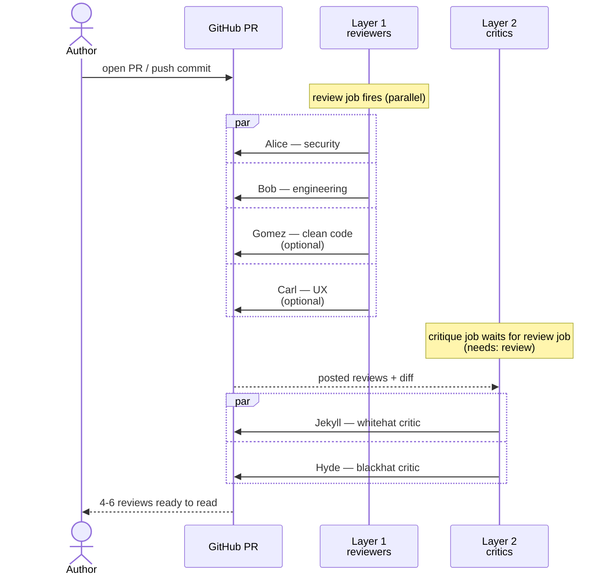
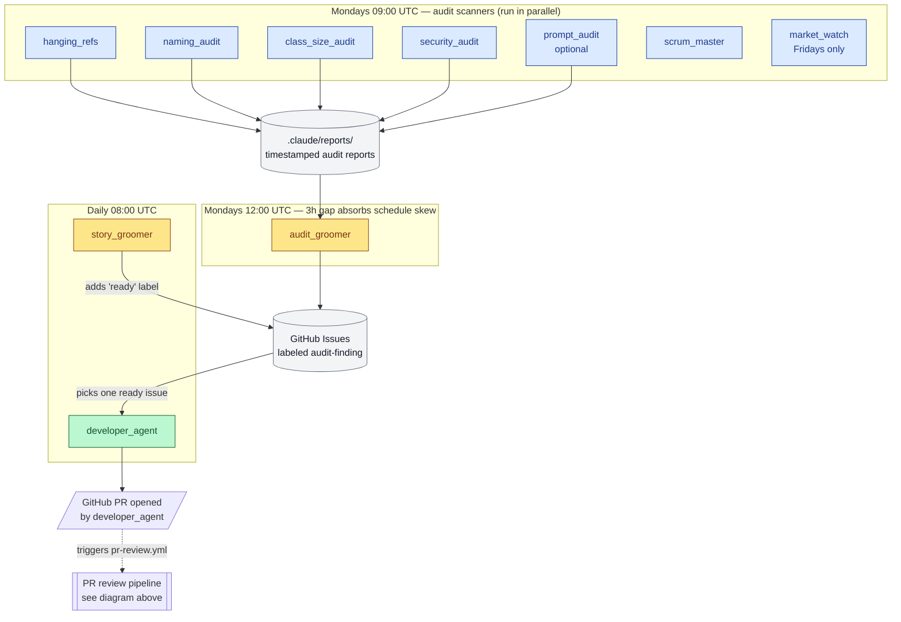

# developer.ai

A drop-in collection of AI engineering agents you can pull into any GitHub project. Once you set it up, every pull request gets reviewed by a small fleet of specialized agents (security, engineering, clean-code, UX, plus two critics that challenge those reviews), and a separate set of agents runs on a schedule to keep your backlog clean and your codebase free of drift.

You fork this repo (or copy its pieces into your existing repo), spend a couple of hours filling in some templates that describe your project, push a PR, and from then on every change you ship has experienced reviewers reading it before you merge.

---

## What this repo is, and what it isn't

**This repo is a kit.** It contains agent specs (markdown files Claude Code reads at runtime), reference GitHub Actions workflows, project-context templates, worked examples, and a small library of skills. It is not a service you sign up for — there's no SaaS dashboard, no API to call. Everything runs inside your own GitHub repo against your own Actions minutes (or self-hosted runners), and you pay Anthropic for the model calls the agents make. The kit is MIT-licensed; fork it and modify freely.

**This repo is not the agents themselves.** The agents run inside Claude Code via the [`anthropics/claude-code-action`](https://github.com/anthropics/claude-code-action) GitHub Action. This repo is what tells those agents who they are, what to look for, and what your project's conventions are. Think of it as a job description plus a company handbook.

**Why this exists.** The agents themselves are general-purpose; they need calibration to be useful on a specific codebase. Most teams spend weeks getting that calibration right and end up with bespoke setups that don't survive a team change. This repo packages a working calibration as a starting point: a real set of reviewers tuned by a working production codebase, plus the templates that let you adapt that tuning to your own project in 1-2 hours instead of weeks.

---

## Who should use it

- **Solo developers and small teams** who want code review without a second human. Alice and Bob catch most of what an experienced reviewer would catch, and Jekyll and Hyde catch the parts where Alice and Bob were wrong.
- **Teams adopting AI-assisted development** who want guardrails on what the AI writes. The same review pipeline that reviews human PRs reviews AI-written PRs.
- **Open-source maintainers** who want consistent automated review on contributor PRs without paying for a managed service.
- **Anyone tired of manually filing tracking issues for shipped work** — the scrum-master agent does that bookkeeping autonomously.

You should probably NOT use it if:

- Your project is a one-off prototype you'll throw away in a month (setup cost won't pay back).
- You don't have a GitHub repo (the agents file issues and post PR reviews via the GitHub API; that's the integration surface).
- You can't afford Anthropic API tokens (a typical small project burns a few dollars a week; large repos with many PRs scale up from there).

---

## How a typical adopter uses it (the user journey)

1. **Day 1, morning** (~30 min): Fork or copy this repo's contents into your target repo. Set the `CLAUDE_CODE_OAUTH_TOKEN` GitHub secret. Replace the `REPO_OWNER/REPO_NAME` placeholders. Pick your default branch in the workflow files. ([ADAPTING.md](ADAPTING.md) walks you through this.)
2. **Day 1, afternoon** (~1-2 hr): Fill in `templates/PROJECT_CONTEXT.md`, `templates/SECURITY.md`, and `templates/ARCHITECTURE.md`. These three documents tell every agent what your project is, who uses it, how big it needs to be, and what's off the table. ([CALIBRATE.md](CALIBRATE.md) walks you through this.)
3. **Day 1, evening**: Open a throwaway PR — even a one-line README edit — to see the agents fire. Alice and Bob post reviews; Jekyll and Hyde follow up. Tune the templates if findings are noisy or silent.
4. **Day 2 onward**: Open PRs as you normally would. The agents fire automatically. On the rare PR where you don't want them (a giant infra refactor, or an emergency hotfix), add the `skip-ci` label.
5. **Once a week** (Mondays by default): The audit bots scan the codebase for drift, dead code, naming violations, security drift, and ecosystem changes. They write reports to `.claude/reports/`. The `audit-groomer` bot reads those reports the next day and files pickup-ready issues. The `developer-agent` bot picks one issue per day and opens a PR for it.
6. **Once a quarter**: Re-read your templates and update the parts that drifted (your scale target grew, you added a new container, you changed your hosting model). The agents pick up the new calibration on the next run.

---

## The PR labels you can use to control the agents

GitHub PR labels are how you tell the workflows "don't fire on this one." Two labels are wired up out of the box:

| Label | Effect |
|---|---|
| `skip-ci` | The PR review workflow (Alice, Bob, Gomez, Carl, plus Jekyll and Hyde) does not fire on this PR. Use it for very large infrastructure-only PRs, doc-only PRs, or other changes where agent review would burn Claude tokens without exercising any meaningful code path. |
| `renovate[bot]` (PR author, not a label) | Renovate-authored PRs (dependency bumps) skip agent review automatically. You don't add this; Renovate sets it as the PR author when it opens its PRs. |

To skip review on a PR, add the `skip-ci` label **before** the agents fire. The agents trigger on `pull_request` `opened` / `synchronize` / `reopened` events, so:

- **For a new PR**: add the label immediately after opening, before any commits get pushed.
- **For an in-flight PR**: add the label, then push an empty commit (`git commit --allow-empty -m "skip ci"`) to trigger a re-evaluation that picks up the new label. Or just leave the in-flight reviews alone — they posted already.

To re-enable review on a PR you previously skipped: remove the label, then push a commit (any commit) to retrigger.

**Why this matters.** Agent review on a 50-file infrastructure migration is mostly noise. The fork has 5,000 changed lines of YAML and no Alice or Bob finding will tell you anything you don't already know. The `skip-ci` label is the polite way to say "trust me, not this one."

If you want a per-agent skip (run Alice but not Bob, for example), edit the matrix in `workflows/pr-review.yml` and remove the agent from the list. The default matrix is `[bob_engineering, alice_security]`; the comment above it shows the four common configurations.

---

## The GitHub Actions workflows we ship as examples

Two workflow files in `workflows/`. Copy both into your repo's `.github/workflows/` folder. They are minimal reference implementations — they work, but most adopters end up customizing the cron schedules and the runner labels.

### The whole system, end to end

Before drilling into either workflow, here's how the pieces interlock. Two workflows, four "agent fleets", connected by GitHub Issues and Pull Requests as the shared substrate. Human at the corners; everything in between is automation.

```mermaid
flowchart LR
    classDef human   fill:#fef3c7,stroke:#92400e,color:#78350f
    classDef workflow fill:#dbeafe,stroke:#1e40af,color:#1e3a8a
    classDef artifact fill:#f3f4f6,stroke:#6b7280,color:#111827

    Codebase[(your codebase)]:::artifact
    Decisions[(decision docs)]:::artifact
    Issues[(GitHub Issues)]:::artifact
    PRs[(Pull Requests)]:::artifact

    Human(["you<br/>(write decisions,<br/>merge PRs)"]):::human

    Human -->|writes / approves| Decisions
    Human -->|merges| PRs

    subgraph Scheduled ["workflows/scheduled-agents.yml<br/>(cron + dispatch)"]
        Scanners["audit scanners<br/>(weekly Mon 09:00)"]:::workflow
        AG["audit_groomer<br/>(weekly Mon 12:00)"]:::workflow
        SG["story_groomer<br/>(daily 08:00)"]:::workflow
        DA["developer_agent<br/>(daily 08:00)"]:::workflow
        SM["scrum_master<br/>(weekly Mon)"]:::workflow
    end

    subgraph PRReview ["workflows/pr-review.yml<br/>(on every PR)"]
        L1["Layer 1<br/>Alice / Bob / Gomez / Carl"]:::workflow
        L2["Layer 2<br/>Jekyll / Hyde"]:::workflow
    end

    Codebase -.->|scanned by| Scanners
    Scanners -->|write reports| AG
    AG -->|files| Issues
    Decisions -.->|scanned by| SG
    SG -->|files [story] issues<br/>+ adds 'ready' label| Issues
    Issues -->|picks one| DA
    DA -->|opens| PRs
    PRs --> L1
    L1 --> L2
    L2 -->|reviews ready to read| Human

    Human -.->|opens own PRs| PRs
    SM -.->|closes shipped issues<br/>tracks drift| Issues
```

The two boxes at the top are the two workflow files in this repo. The artifacts in the middle column (issues, PRs) are where the workflows hand off to each other. The human appears twice — at the start (writing decision docs and opening PRs of their own) and at the end (merging). Everything else is hands-off.

### `workflows/pr-review.yml`

**When it fires:** every `opened` / `synchronize` / `reopened` event on a pull request targeting the default branch. (Edit the `branches:` field if your default isn't `master`.)

**What it does:** two layers, in sequence. The first layer is the reviewers; the second layer is the critics, which read the first layer's posted reviews and challenge any findings that don't hold up.



End-to-end takes a few minutes wall-clock (the two layers run sequentially, but each layer's jobs run in parallel). On a noisy PR you may see Alice and Bob's reviews land first, then Jekyll and Hyde land a minute or two later. The order is sometimes useful when reading — start with Layer 1 to see the findings, then read Layer 2 to see which findings survived attack.

**Skip conditions:** fork PRs, Renovate PRs, and PRs with the `skip-ci` label. See "The PR labels" above.

**Customization knobs:**

- **The reviewer matrix.** The matrix-config comment lists four common combinations: generic two-agent (default), generic plus Gomez, PWA-flavored two-agent, or all five. Pick what fits your project.
- **The runner.** Default is `ubuntu-latest` (GitHub-hosted). Change to `self-hosted` if you have your own runners and want to avoid the per-minute cost or the queue wait under heavy load.
- **The branch filter.** Defaults to `master`. Change to `main` (or whatever your default is) so only PRs into your default branch trigger review.
- **The concurrency key.** Set to one group per PR with `cancel-in-progress: true`, so pushing a new commit during review cancels the in-flight review and starts fresh.

### `workflows/scheduled-agents.yml`

**When it fires:** the bots are layered across the week so the outputs of one feed the inputs of the next. Three cron schedules plus a manual `workflow_dispatch` trigger.



The data flow is the point: scanners write reports → audit-groomer turns them into issues → story-groomer labels them `ready` → developer-agent picks one up and opens a PR → the PR-review workflow fires on it and the reviewer fleet posts findings. End to end, an audit finding becomes shipped code with no human touch except merge approval at the end.

The three cron schedules in the file:
- **Mondays at 09:00 UTC** — the audit scanners, `scrum_master`, `market_watch` (Fridays only).
- **Mondays at 12:00 UTC** — the `audit_groomer` (3 hours after scanners).
- **Daily at 08:00 UTC** — `developer_agent` and `story_groomer`.

**What each bot does:**

| Bot | What it does on each run |
|---|---|
| `scrum_master` (weekly) | Closes any open issue whose work has shipped in a merged PR. Auto-creates closed tracking issues for merged PRs that lacked one. Opens drift-tracking issues when decision docs reference code that has moved or been deleted. |
| `market_watch` (weekly Fri) | Surfaces ecosystem shifts (framework moves, library releases, AI/tooling patterns) at four severity bands. Writes a report; never files issues. The human reads it Friday morning. |
| `hanging_refs` (weekly) | Scans for dead imports, unused exports, orphan routes, stale env vars. Writes a report; the `audit_groomer` files issues from it on Monday afternoon. |
| `naming_audit` (weekly) | Scans class names for suffix-contract mismatches against your naming-conventions doc. Self-classifies findings; only "flagged" ones escalate. |
| `class_size_audit` (weekly) | Flags classes that crossed the size threshold. Self-classifies into auto-accepted, flagged, or investigate. Auto-accepted classes go silent for 8 weeks unless they grow. |
| `security_audit` (weekly) | Scans for security drift against your `SECURITY.md`: auth-missing routes, hardcoded secrets, cookie hygiene gaps, log-leak risks. |
| `prompt_audit` (weekly, optional) | Only useful if your project ships LLM prompts. Audits prompt templates against your project's prompt-rules doc. |
| `audit_groomer` (weekly Mon noon) | Reads the latest report from each of the four audit scanners (plus optionally prompt_audit). Files one issue per actionable finding. Marks each report finding with `[#NN]` or `[skip]` for idempotency. |
| `developer_agent` (daily) | Picks one open issue with the `ready` label, branches, fixes, opens a PR, waits for the review fleet, applies feedback. Hard-capped at 3 fix cycles per PR. Never merges; that's your call. |
| `story_groomer` (daily) | Mode A: scans approved decision docs for story-shaped sections and files issues. Mode B: evaluates every open issue against a 7-point Definition of Ready and adds the `ready` label when it passes. |

**Skip conditions:** there is no scheduled-agent skip label, by design. If a scheduled bot writes a noisy report one week, you read it, ignore it, and adjust the bot's allowlist file (see the table in [ADAPTING.md](ADAPTING.md) "Configure allowlists").

**Customization knobs:**

- **The cron schedules.** Defaults are UTC. If you're in a heavily off-UTC timezone, edit the cron expressions so the reports land at your local morning. For example, US Pacific would shift Monday 09:00 UTC to 17:00 UTC so the report is ready when you sit down Monday morning local time.
- **Which bots to run.** The `workflow_dispatch` input lets you trigger a single bot manually from the GitHub Actions tab. To permanently disable a bot, remove or comment-out its job block.
- **The runner.** Same `ubuntu-latest` default; same self-hosted swap if you want it.
- **The `workflow_dispatch` chooser.** Lists every bot. Add or remove options to match the bots you've actually wired up.

### What this repo does NOT ship as workflows

A few patterns common in real-world projects are NOT in the reference workflows here. You'll add them yourself based on your stack:

- **CI build/test/lint workflow.** Your existing CI workflow stays as-is; the agents work alongside it, not instead of it.
- **Deploy workflows.** This kit doesn't ship deploy automation because deploy shape varies wildly (containers vs serverless vs static). If your project uses PR labels to gate deploys (e.g., a `deploy-prod` label that triggers a production deploy on merge), wire that up in your own deploy workflow; the pattern is the same as `skip-ci`.
- **Visual-smoke workflow.** Mentioned in the visual-smoke skill but not shipped as a reference workflow because its shape depends on your frontend build tool. The skill documents the pattern.
- **Per-bot workflow files.** The reference `scheduled-agents.yml` puts all bots in one file for simplicity. A larger project may prefer one file per bot (`02-agent-scrum-master.yml`, `02-agent-audit-groomer.yml`, etc.) so each bot's cadence, timeout, and token model can drift independently. Look at `examples/decisions/071-scheduled-bots-on-github-actions.md` for the per-bot pattern and the reasoning.

---

## What's in this repo (full inventory)

### PR review pipeline (up to 6 agents, runs on every PR)

| Agent | File | What it does |
|---|---|---|
| Alice | `agents/pr-review/alice_security.md` | Security review: routes, auth, secrets, cookies, XSS, SSRF, log-leak hygiene |
| Bob | `agents/pr-review/bob_engineering.md` | Engineering review: god classes, naming contracts, fail-loud, over-abstraction |
| Gomez | `agents/pr-review/gomez_cleancode.md` | Line-level clean-code review: names that communicate intent, density, idiom |
| Carl | `agents/pr-review/carl_ux_pwa.md` | UX review: mobile fit, copy quality, latency masking, studio-quality polish |
| Jekyll | `agents/pr-review/jekyll_critic.md` | Whitehat critic: challenges the first-pass reviews from a best-practices angle |
| Hyde | `agents/pr-review/hyde_critic.md` | Blackhat critic: attacks the first-pass fixes for real bypasses |

Alice and Bob also have PWA-flavored variants (`alice_security_pwa.md`, `bob_engineering_pwa.md`) for a React frontend + backend-auth-gateway stack.

### Backlog automation (4 agents)

| Agent | File | What it does |
|---|---|---|
| Developer | `agents/backlog/developer_agent.md` | Self-assigns a `ready` issue, opens a PR, shepherds it through review |
| Scrum Master | `agents/backlog/scrum_master.md` | Closes shipped issues, auto-creates tracking issues, cleans up backlog |
| Story Groomer | `agents/backlog/story_groomer.md` | Decomposes decision docs into stories; evaluates the Definition of Ready |
| Audit Groomer | `agents/backlog/audit_groomer.md` | Turns weekly audit findings into pickup-ready issues |

### Weekly audits (6 agents)

| Agent | File | What it does |
|---|---|---|
| Hanging Refs | `agents/audits/hanging_refs.md` | Dead imports, unused exports, orphan routes, stale env vars |
| Naming Audit | `agents/audits/naming_audit.md` | Suffix/contract mismatches against your naming rules |
| Class Size Audit | `agents/audits/class_size_audit.md` | Flags oversized classes (over ~300 lines or 8 methods) |
| Security Audit | `agents/audits/security_audit.md` | Auth routes, schema validation, secrets, log-leak, cookie hygiene |
| Prompt Audit | `agents/audits/prompt_audit.md` | (Optional) LLM prompt templates against your prompt rules |
| Market Watch | `agents/audits/market_watch.md` | Weekly ecosystem and tooling scan |

### Skills (copy to `.claude/skills/` in your project)

**TypeScript** (`skills/typescript/`): receiving-code-review, test-driven-development, code-refactoring, visual-smoke, dev-harness-for-ui-iteration.

**Python** (`skills/python/`): receiving-code-review, test-driven-development, code-refactoring, visual-smoke.

### Templates (copy to `docs/` in your project, then fill in)

| File | What it calibrates |
|---|---|
| `templates/PROJECT_CONTEXT.md` | What this project is. Every agent reads this. |
| `templates/ARCHITECTURE.md` | System shape and layer responsibilities. Bob and the audits read this. |
| `templates/SECURITY.md` | Trust boundaries, sign-in flow, cookies. Alice and security-audit read this. |
| `templates/decisions/DECISION_TEMPLATE.md` | Shape of a decision doc, with inline guidance. |

### Examples (read for shape, don't copy)

Worked, end-to-end filled versions of every template, plus four decision docs in different shapes (security/vendor, layering, philosophy, ops). See `examples/README.md` for the tour.

### Engineering docs (copy to `engineering/` in your project)

- `engineering/ENGINEERING_PRINCIPLES.md` — KISS, SOLID, DRY, YAGNI, naming, failure policy
- `engineering/PR_WORKFLOW.md` — opening PRs, greening CI, responding to review
- `engineering/BACKLOG_WORKFLOW.md` — issue lifecycle, Definition of Ready

---

## Setup overview

Setting this up has two parts. Most adopters do part 1 in a single sitting, then part 2 spread across a few days.

1. **Mechanical wire-up** (15-30 minutes) — see [ADAPTING.md](ADAPTING.md). Copy files, replace placeholders, set the GitHub secret.
2. **Project calibration** (1-2 hours) — see [CALIBRATE.md](CALIBRATE.md). Fill in templates and per-agent calibration blocks. This is what makes the agents accurate.

### Quick start

```bash
# In your target repo:
mkdir -p .claude/agents .claude/skills docs/decisions .github/workflows

# Copy the agents
cp -r /path/to/developer.ai/agents/* .claude/agents/

# Copy the skills for your language (pick one)
cp -r /path/to/developer.ai/skills/typescript/* .claude/skills/

# Copy the templates and start filling them in
cp /path/to/developer.ai/templates/PROJECT_CONTEXT.md docs/
cp /path/to/developer.ai/templates/SECURITY.md docs/
cp /path/to/developer.ai/templates/ARCHITECTURE.md docs/
cp /path/to/developer.ai/templates/decisions/DECISION_TEMPLATE.md docs/decisions/

# Copy the workflows
cp /path/to/developer.ai/workflows/*.yml .github/workflows/
```

Then add the `CLAUDE_CODE_OAUTH_TOKEN` GitHub Secret and update the repo references in the workflows. Full setup checklist in [ADAPTING.md](ADAPTING.md).

---

## Writing style for templates and setup docs

The templates and setup docs in this repo avoid jargon where plain English will do — see [STYLE.md](STYLE.md) for the rules. Adopters of this kit are not all senior engineers; the templates are written so a solo developer, a student, or a technical founder can fill them in without having to Google a dozen acronyms.

If you contribute back to this repo, please follow the same rules.

---

## License

MIT. Fork, extend, ship.
