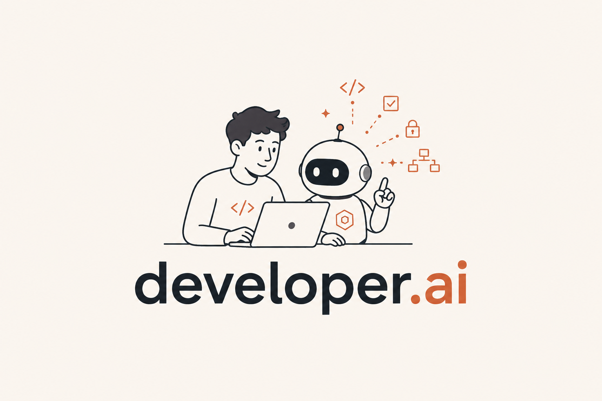
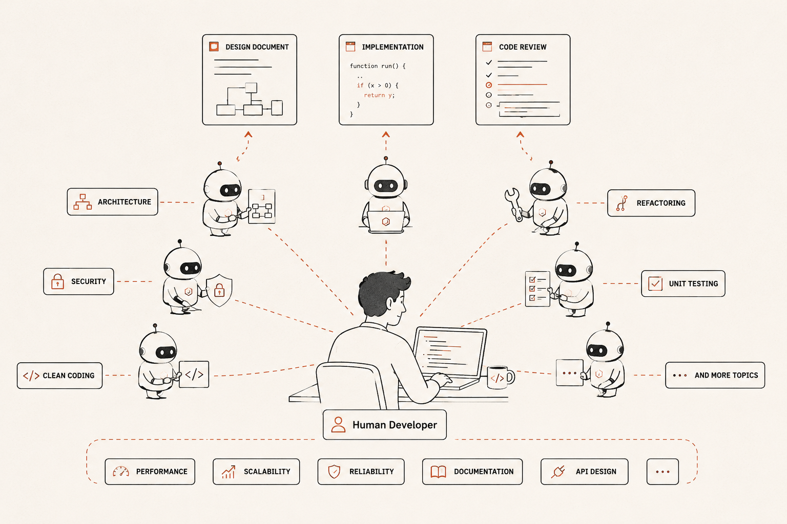

  

# developer.ai

**One developer, with the whole organization behind them.**

A real engineering org gives you things a solo developer simply does not have: a review board that reads every change, a QA function, a platform team watching for drift, a PM who keeps the backlog honest. Not advice about those things. The functions themselves, doing the work.

This kit is that organization, as agents.

**You stay the architect.** Every other seat is filled.

- **Your development agent** designs before it builds, writes the tests first, draws the diagram, and drives a real browser to check the thing actually works.
- **Seven reviewers** read every pull request in two waves, each in their own lane, and argue with each other before they agree.
- **Eight weekly agents** scan for the drift nobody has time to look for, and report on the system itself.
- **Four backlog agents** turn decisions into stories that are ready to pick up, by you or by an agent.

The functions run whether or not you remembered to ask.

Install with `/install`. The principles install for whichever AI tools your team uses; the agents run on Claude Code.

You clone this repo, open Claude Code in it, and run `/install`. The installer asks which of the four capabilities you want before anything else, then about your stack, your conventions, and your repo identity. It writes the calibrated kit into your target repo on a new branch. Once you add the `CLAUDE_CODE_OAUTH_TOKEN` GitHub secret, the agents start firing on your next pull request.

> **The fast install path:** [`INSTALL.md`](INSTALL.md).
> **The manual install path:** [`ADAPTING.md`](ADAPTING.md).
> **Tuning after install:** [`CALIBRATE.md`](CALIBRATE.md) (lives in your target repo after install).
> **Adding your own agents:** [`KIT_EXTEND.md`](KIT_EXTEND.md).

---

## How it actually works

### A normal day

You open Claude Code and ask for a feature. Not a spec, just tell it what you want.

It comes back with a **design document, not code.** You read it, push back on the parts that are
wrong, and when it looks right you tell it to go build.

Now it works. Tests first, then the implementation, then it actually runs the thing. If there
is a UI, it drives a real browser and looks at the screen. Only then does it call the feature
done.

You ask for a pull request. And while you are reading the diff, **your review board is already
on it.** Alice on security. Bob on architecture. Carl on whether the screen is usable at all.
Gomez on names. Phil on whether those tests cover anything. Each one specialized, each one in
its own lane, none of them repeating the others.

You leave your own comments. Then you go back to Claude and run `/code-review`. It pulls every
finding, yours and all seven agents', into **one list**, tells you which ones are worth acting
on and which are noise, and waits for you to decide.

A couple of rounds of that and you merge. Then you do it again.

### Monday morning

There are pull requests waiting that nobody asked for. A market analysis of what moved in your
stack last week. Security drift in your own code. Dead references, naming that has slipped,
classes that grew while you were not looking.

You skim them over coffee, decide what matters, and either promote a finding into real work or
merge the notes and get on with your day.

### The things you do not want to deal with right now

You hit a defect mid-task, or you think of a feature you want later. You do not context-switch
and you do not write a TODO nobody reads. You say **"make a backlog item for that"** and keep
going.

If it is small and well-shaped, the crew picks it up on its own: designs it, builds it, and
hands you a code review. Meanwhile the scrum master walks the backlog once a week and closes
out everything you already fixed, so **you never manage a backlog again.**

### What you end up with

A shorter loop, and every colleague you would have in a real organization: reviewers, QA,
ops, and a PM who keeps the queue honest.

---

## The org chart you get

Every seat below is a function a real engineering organization performs and a solo developer
goes without.

| The seat | Filled by | When it works |
|---|---|---|
| **Architect** | **You.** Design docs are the architecture artifact, and every agent reads the principles that govern them. | Deliberately not automated |
| **Developers** | `feature_agent` plus the skills: test-driven development, refactoring, dev harness, and visual smoke that drives a real browser | Daily, one unit of work at a time |
| **Review board** | Alice, Bob, Phil, Gomez, Carl, then Jekyll and Hyde critiquing them | Every pull request |
| **Platform and ops** | Eight scanners: security drift, dead code, naming, class size, flaky tests, release readiness, prompts, market signals | Monday mornings |
| **PM and scrum** | `story_groomer`, `scrum_master`, `audit_groomer` | Daily and weekly |
| **Tech writer** | Not yet filled | |

Those seats install as four capabilities, and **you pick which ones you want** before the
installer asks anything else. It defaults to the principles alone, which is a real install and
not a demo: better rules in front of whatever agent you already use is most of the value, and
it costs nothing per run.

Two constraints the installer enforces rather than hopes for. Backlog automation implies the
review fleet, because `feature_agent` opens pull requests and a PR nobody reviews is the
outcome this kit exists to prevent. Backlog automation also needs GitHub specifically, because
it is built on GitHub Issues and labels.

**Pipelines ship for GitHub Actions, GitLab CI, Bitbucket, and Azure DevOps.** GitHub is the
reference implementation and gets all seven reviewers plus the backlog agents; the other three
get the principles, the audits, and five reviewers. They are stubbed against each platform's
API and want validation in a real tenant, so if you deploy one, please open an issue and tell
us what happened. Details in [`ci/README.md`](ci/README.md).

---

## What it costs

The agents authenticate with a Claude Code OAuth token, so they draw on **your Claude
subscription**, not a per-token API bill. The question is not "how many dollars" but "does
this fit inside my plan alongside my own work?"

**One real data point.** On a Max plan, working 8-10 hours a day in Claude Code, running 5-10
full PR reviews per day for a week fit inside the plan alongside normal development. That is
the whole fleet on each PR, not a single reviewer. One repo, one working pattern, one week:
treat it as an order-of-magnitude anchor, not a guarantee.

**Almost all consumption is PR review.** The audits look like a large fleet on the diagram,
but they run once a week and round to nothing against a week of development. The only variable
worth watching is **reviewers enabled, times PRs opened, times diff size**.

Levers, most effective first:

1. **Drop optional reviewers.** Gomez and Carl are the two most commonly dropped, and this is by far the biggest lever.
2. **Use `skip-ci` liberally.** Doc-only and lockfile-bump PRs burn a full pass for nothing.
3. **Lower `effort`.** Each workflow job passes `--effort`; one step down noticeably reduces spend at some cost in depth.
4. **Split large PRs.** One 900-line PR costs every reviewer more than three 300-line PRs cost them individually.

Retuning the audit schedule is deliberately not on that list. It is a rounding error, and
turning audits off trades away the drift detection that is the cheapest thing the kit does.

The model split that makes it fit: **Opus 5 orchestrating, Sonnet 5 as the workers.** The
expensive reasoning belongs in the layer deciding what to look at; the reading is largely
mechanical. `--model` in each workflow job is where you set it.

---

## Controlling the agents

**Labels.** Add `skip-ci` to a pull request and the review pipeline does not fire. Add it
before the agents run: they trigger on `opened` and `synchronize`, so on an in-flight PR you
add the label then push an empty commit to retrigger. Renovate-authored PRs skip
automatically. For a per-agent skip, edit the matrix in `workflows/pr-review.yml`.

**Or just ask.** Every agent runs conversationally as well as on a schedule, and it is the
same file either way. "Security review this PR" runs the same Alice the workflow runs. Leave
the schedule on and ask whenever the impulse strikes: if you wonder on a Wednesday whether
anything has bloated past 300 lines, ask, rather than waiting for Monday.

---

## Getting it

Clone this repo, open Claude Code in it, run `/install`. The wizard asks which capabilities
you want, then your stack, conventions, and repo identity, and writes the calibrated kit into
your target repo on a new branch. Add the `CLAUDE_CODE_OAUTH_TOKEN` secret and the agents
start firing on your next pull request.

Then open a throwaway PR and watch them post. Tune from there.

**The kit is worth it if** you want code review without a second human, you want guardrails on what
an AI writes into your repo, or you are tired of filing tracking issues by hand. **It is
probably not worth it if** the project is a prototype you will throw away next month.

---

## Where everything lives

| | |
|---|---|
| [`INSTALL.md`](INSTALL.md) | The fast install path |
| [`ADAPTING.md`](ADAPTING.md) | The manual path, and taking only the parts you want |
| [`CALIBRATE.md`](CALIBRATE.md) | Tuning the agents to your project after install |
| [`agents/`](agents/) | Every agent, what it does, and the full inventory |
| [`engineering/`](engineering/) | The principles the agents enforce: [engineering](engineering/ENGINEERING_PRINCIPLES.md), [testing](engineering/TESTING_PRINCIPLES.md), [security](engineering/SECURITY_PRINCIPLES.md), [observability](engineering/OBSERVABILITY_PRINCIPLES.md), [AI agents](engineering/AI_AGENT_PRINCIPLES.md), [PR workflow](engineering/PR_WORKFLOW.md), [backlog workflow](engineering/BACKLOG_WORKFLOW.md) |
| [`workflows/`](workflows/) | GitHub Actions pipelines, the diagrams, and why they are shaped this way |
| [`ci/`](ci/) | GitLab, Bitbucket, and Azure DevOps |
| [`toolconfigs/`](toolconfigs/) | Config for the seven AI coding tools |
| [`templates/`](templates/) | What you fill in: project context, architecture, security, debugging, calibration |
| [`examples/reviews/`](examples/reviews/) | Real, unedited output from five agents on a fixture you can rerun |
| [`KIT_EXTEND.md`](KIT_EXTEND.md) | Adding your own agents, and the tag convention |
| [`AGENT_RELIABILITY.md`](AGENT_RELIABILITY.md) | Why a silent agent fails the build |
| [`BENCHMARKING.md`](BENCHMARKING.md) | How we plan to measure whether the fleet is accurate |
| [`STYLE.md`](STYLE.md) | Writing conventions for the docs |
| [`DOMAIN_SPECIFIC.md`](DOMAIN_SPECIFIC.md) | Patterns that did not generalize, kept as worked examples |

---

## License

MIT. See [LICENSE](LICENSE).
