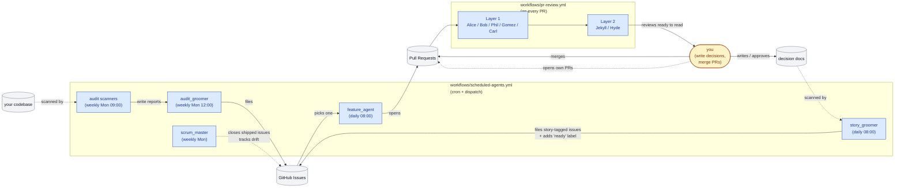
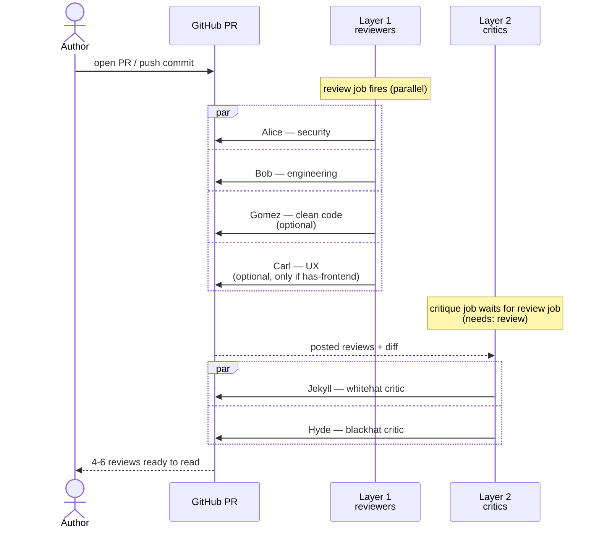
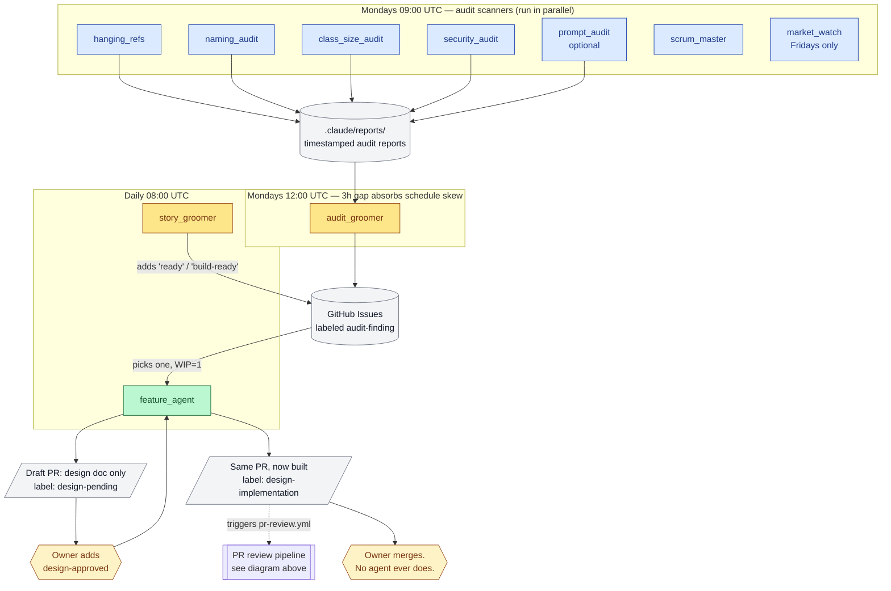

# Workflows

Three YAML files and two scripts. They copy into `.github/workflows/` and `.github/scripts/`
unchanged apart from the repo slug and default-branch name.

| File | Fires on | What it does |
|---|---|---|
| `pr-review.yml` | Every pull request | Two waves of reviewer agents post advisory comments. |
| `scheduled-agents.yml` | Cron and manual dispatch | Twelve audit, groomer, and feature jobs. |
| `run-agent.yml` | Called by the two above | The reusable job that actually runs an agent. |
| `scripts/finalize-agent-review.sh` | Inside `pr-review.yml` | Turns an agent that produced nothing into a visible failure. |
| `scripts/reviewPosted.mjs` | Inside `finalize-agent-review.sh` | Asks the API whether the review really landed. |

This file explains the decisions behind them, so you can change them without rediscovering
why they are shaped this way. What each agent does is in [`../readme.md`](../readme.md);
adapting the files to your repo is in [`../ADAPTING.md`](../ADAPTING.md).

---

## One reusable job runs every agent

`run-agent.yml` owns the checkout, the token pre-flight, and the call into
`anthropics/claude-code-action`. Every other job is a ten-line call into it.

The alternative is twelve near-identical thirty-line blocks, and its failure mode is not the
obvious one. The obvious cost is typing. The real cost is that a fix applied to one block
silently fails to apply to the other eleven, and nothing tells you: the workflow stays green,
because eleven jobs doing the old thing correctly is indistinguishable from eleven jobs doing
the right thing.

Adding an agent is now: one job below, one entry in the `workflow_dispatch` choice list.

**What deliberately stays in the caller:** the `if:` condition and the `permissions:` block.
A reusable workflow cannot decide whether it should have been called, and permissions must be
grantable per job or the narrowest job forces its needs on everyone.

## The `if:` condition, not separate workflow files

GitHub fires the whole workflow on every cron in its `schedule:` list, so a file with three
crons runs all twelve jobs three times a day unless each job checks which cron woke it. That
is what `github.event.schedule == '0 9 * * 1'` is doing in every job.

The alternative is twelve files, one cron each. It is cleaner to read and it is what
`ADAPTING.md` suggests for adopters who want per-bot control. One file is the default because
twelve files means twelve places to update when the shared shape changes, which is the same
problem `run-agent.yml` exists to solve.

## Agents commit their own reports

Each audit job's instructions end with "commit and push it. A report left only in the runner
is gone when the job ends." That sentence is load-bearing. An agent that writes a report and
returns its path looks like it succeeded, and the file evaporates with the runner. The
downstream groomer then finds no report and files nothing, and the first symptom is a quiet
Monday.

A committed report is why the workflow grants `contents: write` rather than uploading artifacts. Artifacts
expire and are invisible to the next agent; a committed report is readable by the groomer,
by you, and by `git log`.

## Least privilege, one exception

The workflow-level `permissions:` block grants what most jobs need. `weekly-flaky-test-finder`
overrides it with `actions: read` plus `contents: write` and nothing else, because it reads
the Actions API and writes one report. Its override is not an optimisation, it is a
demonstration: when you add an agent that needs a permission the others do not, narrow that
job rather than widening the top of the file.

`run-agent.yml` only populates `GITHUB_TOKEN` in the agent's environment when the caller sets
`needs_actions_api: true`. An agent that never calls the API never sees the token.

## Silence is a failure, not a pass

`pr-review.yml` runs `finalize-agent-review.sh` after each reviewer. The script asks the API
whether that agent's review actually posted, and fails the job when it did not.

Without it, an agent that crashed, timed out, or returned an empty string produces exactly
what a clean review produces: no comments on the PR. You cannot tell "found nothing" from
"never ran," and the failure mode is the dangerous direction, since you merge believing the
diff was reviewed. The full reasoning is in
[`../AGENT_RELIABILITY.md`](../AGENT_RELIABILITY.md).

**If you copy nothing else from `scripts/`, copy this.** The installer copies it
automatically and marks it executable; a hand-install that skips it leaves every reviewer job
failing on a missing file.

## Two waves, not one

`pr-review.yml` runs the first-pass reviewers as a matrix, then Jekyll and Hyde in a second
job that `needs:` the first. The critics read what the first wave posted, so they cannot run
beside it.

The matrix is also the per-agent switch: drop a name from `matrix.agent` and that reviewer
stops running. There is no per-agent enable flag: the list is the only place the answer
lives.

## Fork guards

Both workflows check the repository slug before running. A fork inherits your workflow files
but not your secrets, so without the guard every fork's PRs fire jobs that fail on a missing
token. Replace `REPO_OWNER/REPO_NAME` with your own slug, per `ADAPTING.md`.

## Model choice

`run-agent.yml` defaults to `claude-sonnet-5` at medium effort. `daily-feature-agent`
overrides both, because it writes design documents and makes scope calls that the scanners
never have to make. Everything else scans a codebase against a spec, which the smaller model
does well and cheaply.

If you tune one thing here, tune this. See "What it costs" in [`../readme.md`](../readme.md).

---

## Other platforms

GitLab, Bitbucket, and Azure DevOps live in [`../ci/`](../ci/), which carries its own README.
The split is worth knowing when you edit either side:

- **This directory is the reference implementation.** GitHub is the only platform proven on
  live runs, and the only one where all seven reviewers and the backlog agents work.
- **`../ci/` mirrors it** with a shared posting adapter, because those three platforms have
  no equivalent of `claude-code-action` and no GitHub MCP tools.

**A change to how a reviewer is invoked belongs in both.** The two halves already agree on
the thing that matters most: feed the spec body as the prompt, and fail the job when nothing
posted. Let those drift and one platform starts reporting reviews that never happened.

Installer question 11 sets the platform, and question 0 lets an adopter take the principles,
the audits, or the reviewers without taking the parts their platform cannot run.

---

## The whole system, in two diagrams

Two workflow files in `workflows/`. The installer copies both into your target repo's `.github/workflows/` folder, editing the `REPO_OWNER/REPO_NAME` and default-branch placeholders to match your wizard answers.

### The whole system, end to end

### `pr-review.yml`

**When it fires:** every `opened` / `synchronize` / `reopened` event on a pull request targeting the default branch.

**What it does:** two layers, in sequence.

**Skip conditions:** fork PRs, Renovate PRs, and PRs with the `skip-ci` label.

### `scheduled-agents.yml`

Twelve jobs, each a ten-line call into the reusable `run-agent.yml`. What that file
owns, why the `if:` conditions look the way they do, and what to change when you add an agent
are all in [`workflows/README.md`](README.md).

**When it fires:** the bots are layered across the week so the outputs of one feed the inputs of the next.

---
